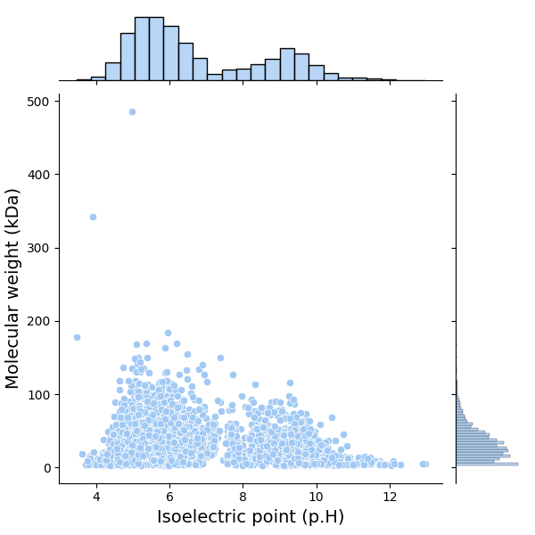
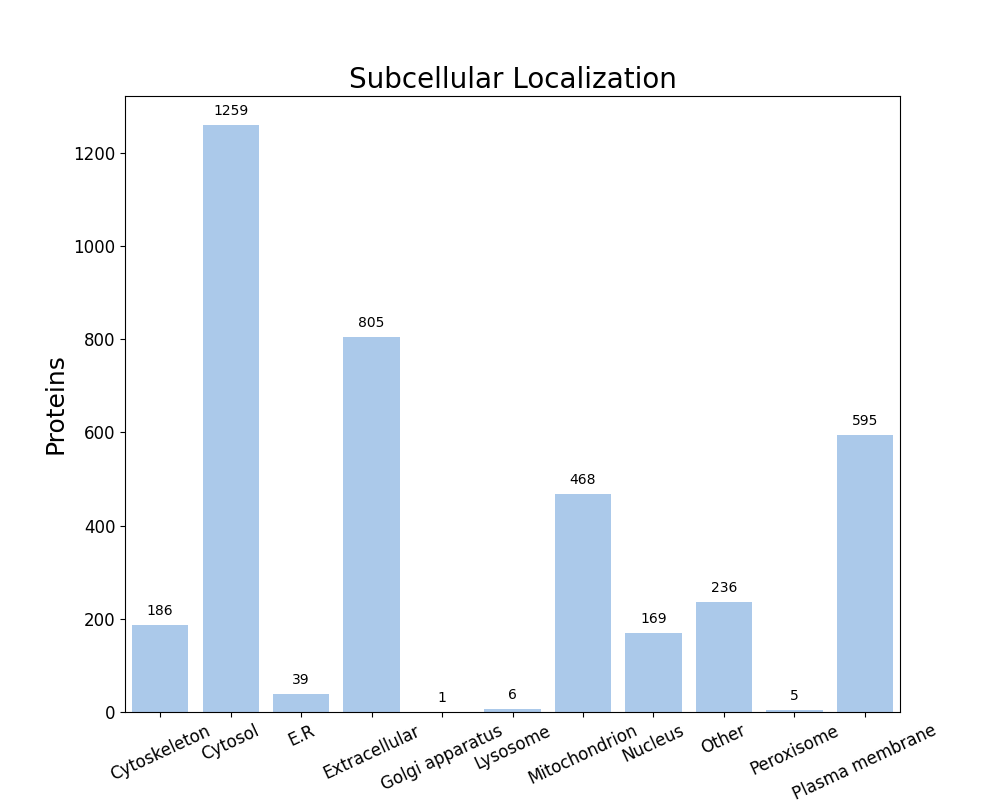

FastProtein Software 1.0
========================
##### Protein Information Software

---
### Summary
| Information                          | Value              |
| ------------------------------------ | ------------------ |
| Processed proteins                   | 3769               |
| Molecular mass (kda) mean            | 33.91 &#177; 25.60 |
| Isoelectric point mean               | 6.77 &#177; 1.82   |
| Hydrophicity mean                    | -0.08 &#177; 0.42  |
| Aromaticity mean                     | 0.09 &#177; 0.03   |
| Proteins with TM                     | 879                |
| Proteins with SP                     | 695                |
| Proteins with GPI                    | 37                 |
| Membrane proteins                    | 900                |
| Proteins with E.R Retention domains  | 491                |
| Proteins with NGlycosylation domains | 2279               |
### Molecular mass (kDa) vs Isoelectric point (pH)

---
### Subcellular localization (by WolfPSort) - Organism: animal

| Subcellular localization | Proteins |
| ------------------------ | -------- |
| Cytosol                  | 1259     |
| Extracellular            | 805      |
| Plasma membrane          | 595      |
| Mitochondrion            | 468      |
| Other                    | 236      |
| Cytoskeleton             | 186      |
| Nucleus                  | 169      |
| E.R                      | 39       |
| Lysosome                 | 6        |
| Peroxisome               | 5        |
| Golgi apparatus          | 1        |
---
### E.R Retention domain summary
| Domain | Quantity |
| ------ | -------- |
| QQEL   | 31       |
| KEEL   | 32       |
| ADEL   | 48       |
| AEEL   | 57       |
| AQEL   | 35       |
| ANEL   | 30       |
| REEL   | 37       |
| SDEL   | 33       |
| KQEL   | 28       |
| RDEL   | 28       |
Only top 10

---
### NGlyc domain summary
| Domain | Quantity |
| ------ | -------- |
| NAT    | 179      |
| NAS    | 206      |
| NQS    | 170      |
| NLS    | 342      |
| NLT    | 300      |
| NIS    | 198      |
| NVS    | 203      |
| NGS    | 182      |
| NVT    | 182      |
| NSS    | 166      |
Only top 10

---
| Id     | Length |  kDa   | Isoelectric_Point | Hydropathy | Aromaticity |  Localization   | TMHMM_2 | Phobius_TM | PredGPI | Membrane_evidences | Membrane_evidences_detail |  SignalP5   | Phobius_SP | ER_Retention_Total | NGlyc_Total |              ER_Retention_Domains               |                                                                                                                                                                                                                                                                                NGlyc_Domains                                                                                                                                                                                                                                                                                 |                        Header                         | Local_alignment_description | Gene_Ontology | Interpro_Annotation | PFAM_Annotation | Panther_Annotation |
| ------ |:------:|:------:|:-----------------:|:----------:|:-----------:|:---------------:|:-------:|:----------:|:-------:|:------------------:|:-------------------------:|:-----------:|:----------:|:------------------:|:-----------:|:-----------------------------------------------:|:----------------------------------------------------------------------------------------------------------------------------------------------------------------------------------------------------------------------------------------------------------------------------------------------------------------------------------------------------------------------------------------------------------------------------------------------------------------------------------------------------------------------------------------------------------------------------:|:-----------------------------------------------------:| --------------------------- | ------------- | ------------------- | --------------- | ------------------ |
| P01555 |  258   | 29.34  |       6.11        |   -0.58    |    0.13     |  Extracellular  |    0    |     0      |    -    |         0          |                           | SP(Sec/SPI) |     Y      |         1          |      0      |                  KDEL[254-258]                  |                                                                                                                                                                                                                                                                                                                                                                                                                                                                                                                                                                              |             Cholera enterotoxin subunit A             | -                           |               |                     |                 |                    |
| P01556 |  124   | 13.96  |       8.89        |   -0.08    |    0.10     |  Extracellular  |    0    |     0      |    -    |         0          |                           | SP(Sec/SPI) |     Y      |         0          |      2      |                                                 |                                                                                                                                                                                                                                                                           NIT[24-27];NKT[110-113]                                                                                                                                                                                                                                                                            |             Cholera enterotoxin subunit B             | -                           |               |                     |                 |                    |
| P09545 |  741   | 81.96  |       5.30        |   -0.39    |    0.10     |  Extracellular  |    0    |     0      |    -    |         0          |                           | SP(Sec/SPI) |     Y      |         0          |      5      |                                                 |                                                                                                                                                                                                                                                       NNS[184-187];NIS[203-206];NAS[283-286];NRS[379-382];NLT[551-554]                                                                                                                                                                                                                                                       |                       Hemolysin                       | -                           |               |                     |                 |                    |
| P23247 |  337   | 37.38  |       4.78        |   -0.12    |    0.09     |  Cytoskeleton   |    0    |     0      |    -    |         0          |                           |      -      |     -      |         0          |      3      |                                                 |                                                                                                                                                                                                                                                                     NTS[95-98];NCS[130-133];NVT[153-156]                                                                                                                                                                                                                                                                     |        Aspartate-semialdehyde dehydrogenase 2         | -                           |               |                     |                 |                    |
| P37093 |  503   | 56.36  |       5.89        |   -0.28    |    0.05     |     Cytosol     |    0    |     0      |    -    |         0          |                           |      -      |     -      |         1          |      2      |                  AEEL[104-108]                  |                                                                                                                                                                                                                                                                          NAT[229-232];NSS[281-284]                                                                                                                                                                                                                                                                           |           Type II secretion system ATPase E           | -                           |               |                     |                 |                    |
| P45779 |  674   | 73.47  |       5.06        |   -0.13    |    0.05     |  Mitochondrion  |    0    |     0      |    -    |         0          |                           | SP(Sec/SPI) |     Y      |         0          |      6      |                                                 |                                                                                                                                                                                                                                                NVS[132-135];NAS[197-200];NKT[211-214];NET[411-414];NDS[451-454];NTS[547-550]                                                                                                                                                                                                                                                 |                     Secretin GspD                     | -                           |               |                     |                 |                    |
| Q9KL03 |  173   | 20.68  |       5.58        |   -0.45    |    0.12     |      Other      |    0    |     0      |    -    |         0          |                           |      -      |     -      |         0          |      1      |                                                 |                                                                                                                                                                                                                                                                                 NRS[169-172]                                                                                                                                                                                                                                                                                 |           Spermidine N(1)-acetyltransferase           | -                           |               |                     |                 |                    |
| Q9KL18 |  460   | 51.29  |       5.32        |   -0.16    |    0.07     |  Cytoskeleton   |    0    |     0      |    -    |         0          |                           |      -      |     -      |         1          |      0      |                  AQEL[130-134]                  |                                                                                                                                                                                                                                                                                                                                                                                                                                                                                                                                                                              |        3'3'-cGAMP-specific phosphodiesterase 3        | -                           |               |                     |                 |                    |
| Q9KL41 |  176   | 20.30  |       5.16        |   -0.45    |    0.09     |      Other      |    0    |     0      |    -    |         0          |                           |      -      |     -      |         0          |      1      |                                                 |                                                                                                                                                                                                                                                                                  NVS[39-42]                                                                                                                                                                                                                                                                                  |                  Heme oxygenase HutZ                  | -                           |               |                     |                 |                    |
| Q9KLR1 |  431   | 49.31  |       5.72        |   -0.27    |    0.09     |      Other      |    0    |     0      |    -    |         0          |                           |      -      |     -      |         0          |      2      |                                                 |                                                                                                                                                                                                                                                                          NVT[165-168];NES[306-309]                                                                                                                                                                                                                                                                           |        3'3'-cGAMP-specific phosphodiesterase 1        | -                           |               |                     |                 |                    |
| Q9KM24 |  499   | 56.58  |       6.19        |   -0.14    |    0.10     | Plasma membrane |    0    |     1      |    -    |         2          |    PHOBIUS_TM&#124;SL     | SP(Sec/SPI) |     Y      |         0          |      2      |                                                 |                                                                                                                                                                                                                                                                           NLT[19-22];NVT[382-385]                                                                                                                                                                                                                                                                            |             Sensor histidine kinase VxrA              | -                           |               |                     |                 |                    |
| Q9KN86 |  430   | 48.32  |       9.58        |   -0.36    |    0.08     |  Extracellular  |    0    |     0      |    -    |         0          |                           |      -      |     Y      |         0          |      2      |                                                 |                                                                                                                                                                                                                                                                           NLS[82-85];NGT[297-300]                                                                                                                                                                                                                                                                            |          Peptidoglycan DD-endopeptidase ShyA          | -                           |               |                     |                 |                    |
| Q9KNI1 |  723   | 78.11  |       5.85        |    0.08    |    0.07     |     Cytosol     |    0    |     0      |    -    |         0          |                           |      -      |     -      |         0          |      3      |                                                 |                                                                                                                                                                                                                                                                    NTS[427-430];NFT[519-522];NGS[585-588]                                                                                                                                                                                                                                                                    |      Fatty acid oxidation complex subunit alpha       | -                           |               |                     |                 |                    |
| Q9KQG2 |  370   | 40.50  |       5.63        |   -0.05    |    0.06     |     Cytosol     |    0    |     0      |    -    |         0          |                           |      -      |     -      |         0          |      1      |                                                 |                                                                                                                                                                                                                                                                                 NCT[132-135]                                                                                                                                                                                                                                                                                 |        Aspartate-semialdehyde dehydrogenase 1         | -                           |               |                     |                 |                    |
| Q9KRA3 |  401   | 44.06  |       4.83        |   -0.21    |    0.08     |     Cytosol     |    0    |     0      |    -    |         0          |                           |      -      |     -      |         0          |      0      |                                                 |                                                                                                                                                                                                                                                                                                                                                                                                                                                                                                                                                                              |    Enoyl-[acyl-carrier-protein] reductase [NADH] 1    | -                           |               |                     |                 |                    |
| Q9KS12 |  4558  | 485.36 |       4.98        |   -0.38    |    0.07     |  Mitochondrion  |    0    |     0      |    -    |         0          |                           |      -      |     -      |         3          |     39      | KEEL[2440-2444];AQEL[2951-2955];ADEL[3548-3552] | NYS[28-31];NDT[71-74];NKS[102-105];NVS[108-111];NVT[148-151];NLS[168-171];NIT[214-217];NDS[580-583];NVT[603-606];NIS[697-700];NTT[786-789];NGT[955-958];NGT[1031-1034];NVT[1151-1154];NIT[1272-1275];NVT[1282-1285];NAS[1341-1344];NTS[1367-1370];NTS[1519-1522];NNS[1755-1758];NQS[2097-2100];NGT[2129-2132];NTT[2189-2192];NAT[2309-2312];NAT[2569-2572];NVT[2585-2588];NIS[2831-2834];NDT[2860-2863];NDT[2937-2940];NCS[3033-3036];NVT[3371-3374];NNT[3539-3542];NSS[3707-3710];NVS[3790-3793];NSS[4100-4103];NLT[4166-4169];NIS[4195-4198];NDT[4264-4267];NDS[4462-4465] |    Multifunctional-autoprocessing repeats-in-toxin    | -                           |               |                     |                 |                    |
| Q9KS45 |  1163  | 128.83 |       5.89        |   -0.47    |    0.08     |     Cytosol     |    0    |     0      |    -    |         0          |                           |      -      |     -      |         0          |      2      |                                                 |                                                                                                                                                                                                                                                                          NLT[53-56];NAT[1049-1052]                                                                                                                                                                                                                                                                           |            Actin cross-linking toxin VgrG1            | -                           |               |                     |                 |                    |
| Q9KSE5 |  407   | 44.07  |       6.16        |   -0.11    |    0.06     |  Extracellular  |    0    |     0      |    -    |         0          |                           | SP(Sec/SPI) |     Y      |         0          |      1      |                                                 |                                                                                                                                                                                                                                                                                 NTT[347-350]                                                                                                                                                                                                                                                                                 |         Broad specificity amino-acid racemase         | -                           |               |                     |                 |                    |
| Q9KU93 |  433   | 48.98  |       9.24        |   -0.37    |    0.11     |  Extracellular  |    0    |     1      |    -    |         1          |        PHOBIUS_TM         |      -      |     -      |         1          |      0      |                  KDEL[119-123]                  |                                                                                                                                                                                                                                                                                                                                                                                                                                                                                                                                                                              |          Peptidoglycan DD-endopeptidase ShyC          | -                           |               |                     |                 |                    |
| Q9KUL5 |  426   | 47.55  |       8.37        |   -0.25    |    0.08     |  Extracellular  |    0    |     0      |    -    |         0          |                           | SP(Sec/SPI) |     Y      |         0          |      5      |                                                 |                                                                                                                                                                                                                                                         NQS[37-40];NTS[41-44];NGS[166-169];NIT[185-188];NGT[291-294]                                                                                                                                                                                                                                                         |          Peptidoglycan DD-endopeptidase ShyB          | -                           |               |                     |                 |                    |
| Q9KUS8 |  390   | 43.05  |       4.82        |   -0.42    |    0.07     |     Cytosol     |    0    |     0      |    -    |         0          |                           |      -      |     -      |         0          |      2      |                                                 |                                                                                                                                                                                                                                                                           NCT[76-79];NRS[134-137]                                                                                                                                                                                                                                                                            |                    GTPase Obg/CgtA                    | -                           |               |                     |                 |                    |
| Q9KVG5 |  156   | 18.06  |       7.16        |   -0.47    |    0.06     |     Cytosol     |    0    |     0      |    -    |         0          |                           |      -      |     -      |         0          |      0      |                                                 |                                                                                                                                                                                                                                                                                                                                                                                                                                                                                                                                                                              |              CD-NTase/cGAS isopeptidase               | -                           |               |                     |                 |                    |
| Q9KVG6 |  584   | 65.49  |       8.49        |   -0.30    |    0.08     |     Cytosol     |    0    |     0      |    -    |         0          |                           |      -      |     -      |         3          |      4      |      KQEL[1-5];SEEL[187-191];QDEL[270-274]      |                                                                                                                                                                                                                                                             NQS[332-335];NLS[340-343];NDS[379-382];NYS[555-558]                                                                                                                                                                                                                                                              | ATP-dependent ubiquitin transferase-like protein Cap2 | -                           |               |                     |                 |                    |
| Q9KVG7 |  436   | 49.36  |       5.57        |   -0.49    |    0.08     |     Cytosol     |    0    |     0      |    -    |         0          |                           |      -      |     -      |         0          |      2      |                                                 |                                                                                                                                                                                                                                                                          NRS[213-216];NDS[268-271]                                                                                                                                                                                                                                                                           |                Cyclic GMP-AMP synthase                | -                           |               |                     |                 |                    |
| Q9KVG8 |  355   | 39.20  |       8.34        |   -0.20    |    0.10     |     Cytosol     |    0    |     0      |    -    |         0          |                           |      -      |     -      |         0          |      2      |                                                 |                                                                                                                                                                                                                                                                          NLS[147-150];NAS[315-318]                                                                                                                                                                                                                                                                           |             cGAMP-activated phospholipase             | -                           |               |                     |                 |                    |
| O85187 |  382   | 40.32  |       9.03        |    1.01    |    0.10     | Plasma membrane |    0    |     10     |    -    |         2          |    PHOBIUS_TM&#124;SL     |      -      |     Y      |         0          |      0      |                                                 |                                                                                                                                                                                                                                                                                                                                                                                                                                                                                                                                                                              |              Na(+)/H(+) antiporter NhaA               | -                           |               |                     |                 |                    |
##### Only top 10 proteins

---

##### Do you have a question or tips? Please contact us! E-mail: renato.simoes@ifsc.edu.br
Generated time: Sun Sep 20 18:57:43 UTC 2026